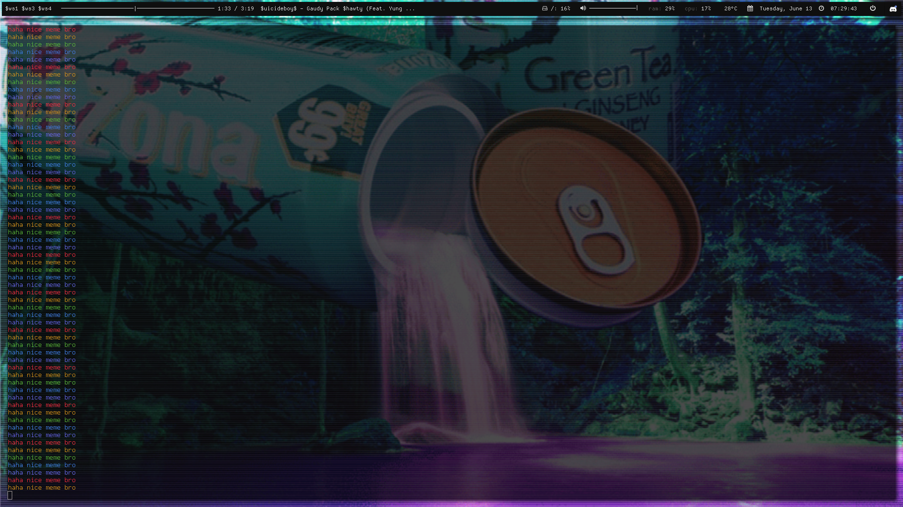
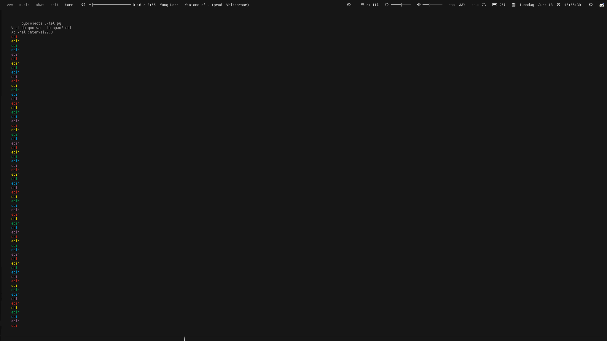

# ebin
Made with my friend [dev](http://github.com/ungentoo) 
(its our first python script no bullies) 
Respects your Freedumbs®™© 
It's called ebin because the original program displayed "ebin" over and over again 
I have only tested this on GNU+Linux, not sure if it works on Windows of MacOS/OSX, but it should.  
Use pip install termcolor to run this.  
My screenshot 
 
[ungentoo's](http://github.com/ungentoo) screenshot 

